# The minimap
 A minimap is a video games navigation tool with the main pourpose to orientate players on the game space. To understand the concept of navigation on videogames we can look at the earliest games. Most of them  like Space Invaders or Pac-Man could display all its information in one screen so the players did not need any extra information. However, from then on games have grown a lot on complexity and the idea of displaying all the info of the game in one screen was quickly abandoned. Nowadays, games favor larger environments, through scrolling or leaving one screen and entering the next. Here is where the navigations tools are impresindible to help the player keep track of the information about the complex game space like his position on it.
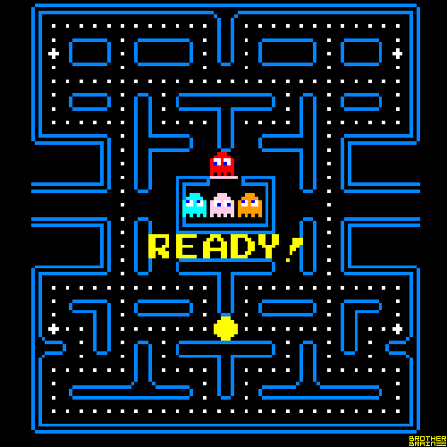
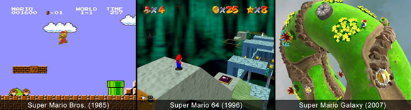
## Navigation tools
[This very interesting gamasutra article](https://www.gamasutra.com/view/feature/4115/no_more_wrong_turns.php?print=1 "Gamasutra article") explains very well the different types of navigation tools used on videogames. Because the pourpose of the research is specifically about the minimap I will just resume the article on this point but if you are interested on the topic deffinately check it out.
The article divides the navigation tools between discrete and immersed. On one hand, the discrete navigation tools are the ones that are part of the Graphical User Interface, making them very noticeable. In this category we find the minimap, the marker and the compass.
### Marker
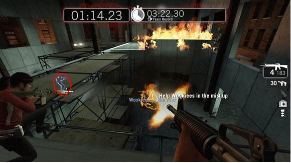
### Minimap + Compass
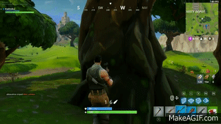

On the other hand, the immerse navigation tools are a part of the game environment. The article classifies them between the categories of attract, identify and guide.
## Minimap
After having introduced the navigation tools now it is time to focus on the minimap.The minimap is a small, simplified version of a larger map. This plays a vital role in many games, especially Real Time Strategy, where it is important to have an overview of the entire map. As part of the discrete navigation tools it is a part of the graphical user interface. Appart from orienting players on the space it also can display a lot of other game information like allies, enemies, buildings, terrain, communication symbols, coordinates, objectives, items...
[Here we have a little bit of history and curiosities of minimaps](https://nucloud.com/blog/a-brief-history-of-maps-in-video-games/ "nucloud article")

### Which games need a minimap
Having the capacity of displaying so many information simplified together is the biggest advantage of minimaps however there is a downside to it. The main issue of minimaps is that they can affect the immersion of the game a lot. They display so much information that the players can play some games and spend most of the time just looking at the minimap losing a lot of the immersive experience.
Continiously, I will show two videos about two gameplays of two FPS games using eyetraker, one with minimap and the other without it. Pay attention to how much time the minimap game player spends looking at it.

[COD gameply with eyetracker](https://www.youtube.com/watch?time_continue=101&v=eR2ymO81_g0&feature=emb_logo "youtube-COD gameply with eyetracker")

[Overwatch gameplay with eyetracker](https://www.youtube.com/watch?time_continue=133&v=eGlFEZ2eUhQ&feature=emb_logo "yputube-Overwatch gameplay with eyetracker")

For more information about the effects of minimaps on the games immersion check this [gamasutra article](https://www.gamasutra.com/blogs/AndriiHoncharuk/20170714/301733/My_personal_crusade_against_minimaps_and_other_corner_based_HUD_elements_in_immersive_games.php "gamasutra article")

For the last years, mostly all open-world games had a mini-map in the corner of the screen. Examples are Grand Theft Auto III to Assassin’s Creed to Red Dead Redemption. Nevertheless, more recent open-world games have omited the minimap and tried other navigation tools. Examples are Assassin’s Creed Origins, Horizon: Zero Down... So if you are doing an open-world game you can do it with a minimap however take into account that it will be less immersive than without it

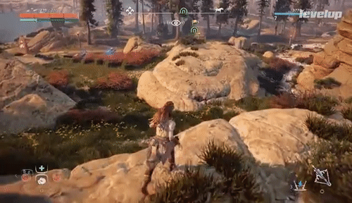

For FPS games we also have some with and some without minimap. As an example and curiosity, until the last Call of duty: Modern warfare, all Call of duty games had the minimap but this last one only displays the minimap on a reward from a killing spree. Other FPS that do not use minimap is [overwatch](https://segmentnext.com/2016/09/21/respond-requests-minimap-overwatch/ "Minimap on overwatch")

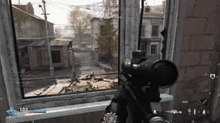

As we can see, on other game generes, we can discuss if we should have a minimap or not, however, the minimap is a must in all strategy games. In order to make the best decisions, the player needs as much information as possible, if easily accesible better, and that is what the minimap does best.

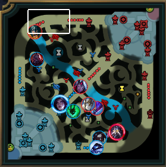 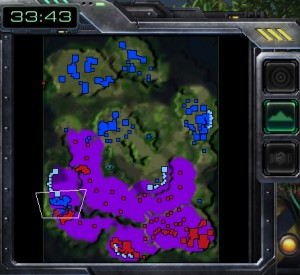

Normally, racing games include a minimap that shows the track blended with the screen. This minimap is not as itrusive as in the open-world games because the player must keep an eye on the track at all times 

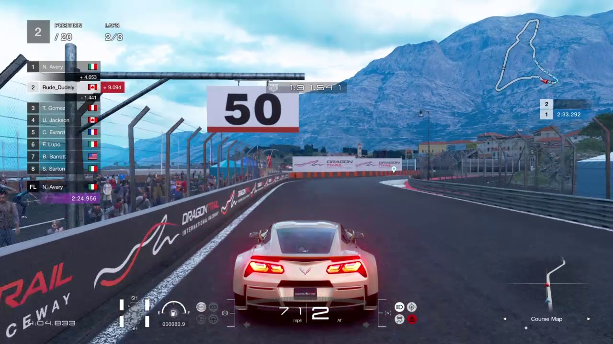

Finally, sports games that do not show all the field of play on the screen tend to include a disimulated minimap. It is not very important because normally you just check it occasionally

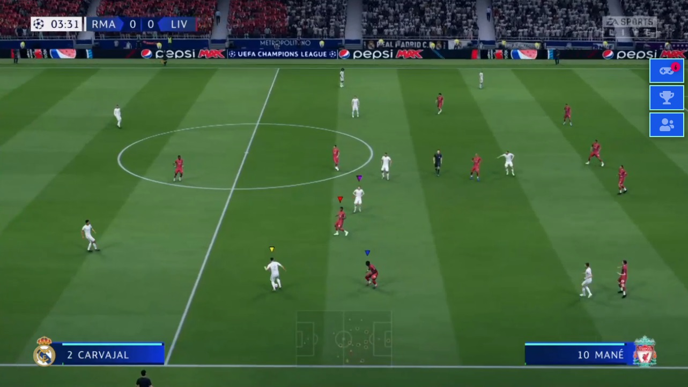

### Where should the minimap be?
Most of the times the minimap is on one of the corners of the screen. Normally it is on top or bottom of the screen depending on where is the rest of the HUD. If the minimap is very key on a game, it is a good idea to put it centered on the bottom. For more information on this topic check this [link](https://gamedev.stackexchange.com/questions/87301/how-do-i-choose-where-to-position-a-mini-map-in-the-hud "where should we put the minimap?")

## Implementation
Check the exercices directory on this github repository to find my minimap implementation. If you want to try to code it by yourself, check the handout directory. To give a basic idea on how I implemented it I draw the main map (using tilesets) on a texture but scaling it to have the right minimap proportions. The implementation covers an isometric and orthogonal map.
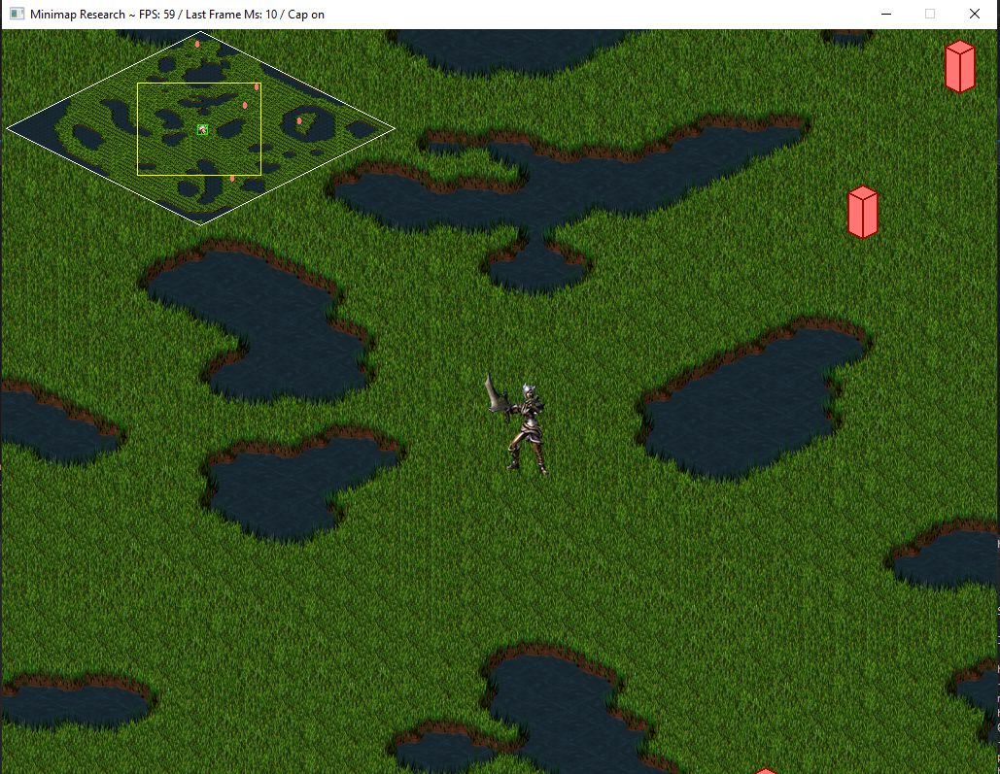  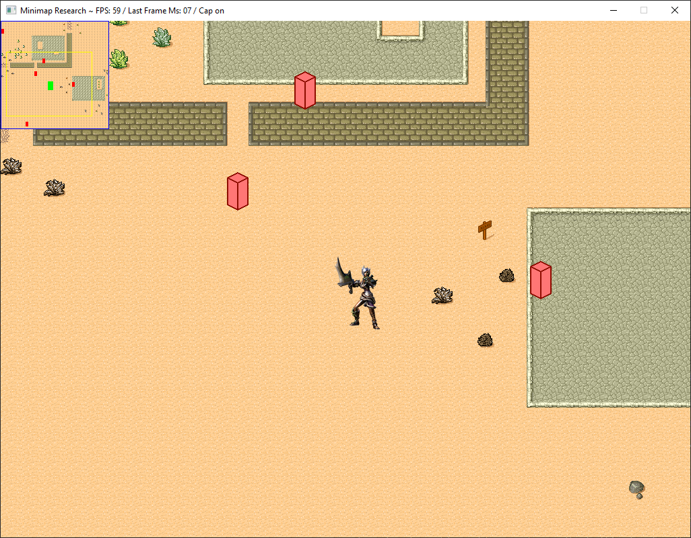

Solution debug keys: 

Display or Undisplay the map (Space key) / Change map (Return key) / Change entitiyes display mode on the minimap (1,2,3 keys) / move the minimap (w(up),s(down),a(right),d(left)) / move the player (arrow keys) / move the camera on minimap (click on minimap)
